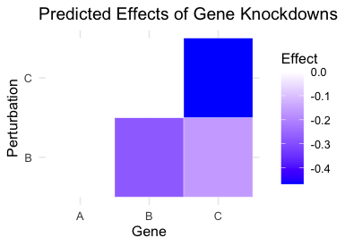

<table>
  <tr>
    <td></td>
    <td><h1>CausalGRN: Deciphering Causal Gene Regulatory Networks from Single-Cell CRISPR Screens</h1></td>
  </tr>
</table>

[](https://opensource.org/licenses/MIT)
[](https://github.com/yub-hutch/CausalGRN/actions/workflows/R-CMD-check.yaml)

**CausalGRN** is a scalable computational framework that infers causal gene regulatory networks (GRNs) and predicts cellular responses to unseen perturbations. It is designed to translate the complex outputs from large-scale single-cell CRISPR screens with scRNA-seq readouts into reliable causal insights.

## Overview

Large-scale single-cell CRISPR screens provide critical data to map causal GRNs. However, analyzing this data to extract reliable causal relationships is a major challenge. CausalGRN addresses this by:

1.  **Mitigating Spurious Correlations**: It employs a novel adaptive thresholding correction to reduce the impact of pervasive spurious partial correlations found in sparse scRNA-seq data, enabling a more robust inference of the network's undirected skeleton.
2.  **Orienting the Network**: It orients the graph using observed perturbation outcomes from CRISPR screens.
3.  **Predicting Perturbation Effects**: The resulting directed GRN can be used to predict the downstream effects of novel, unseen perturbations via network propagation.

Across both simulations and diverse experimental datasets, CausalGRN substantially outperforms existing approaches in network reconstruction accuracy and in predicting the effects of unseen perturbations.

## Installation

You can install the development version of CausalGRN from GitHub with:

```r
# install.packages("devtools")
devtools::install_github("yub-hutch/CausalGRN")
```

## Example Usage

CausalGRN can be used for two main tasks:
1.  Inferring a causal Gene Regulatory Network (GRN).
2.  Predicting the effects of unseen perturbations using a known (or inferred) GRN.

### 1. Inferring a Causal GRN

Here is a toy example demonstrating how to use CausalGRN to infer a network and comparing its output to other common GRN inference methods.

<details>
<summary>Click to expand the full example code for network inference</summary>

```r
# --- 0. SETUP: Load Libraries & Define Ground Truth ---
library(dplyr)
library(igraph)
library(CausalGRN)

# Define all simulation parameters upfront
a <- b <- 1
sd <- 2
s <- -4
nwt <- 1e5 # User-specified WT sample size
npt <- 1e4 # User-specified perturbed sample size
knockdown_efficacy <- 0.9 # 90% knockdown efficiency

# Define the ground truth graph for this simulation
ground_truth <- igraph::make_graph(~ A -+ B, B -+ C)
E(ground_truth)$weight <- c(a, b)

# --- 1. DATA SIMULATION: Create the Toy Example ---
set.seed(123)

# Generate Wild-Type (WT) Data
x_latent_wt <- rnorm(nwt, 0, sd)
y_latent_wt <- rnorm(nwt, a * x_latent_wt + s, sd)
z_latent_wt <- rnorm(nwt, b * (y_latent_wt - s), sd)
wt_counts <- cbind(
  X = rpois(nwt, exp(x_latent_wt)),
  Y = rpois(nwt, exp(y_latent_wt)),
  Z = rpois(nwt, exp(z_latent_wt))
)
colMeans(wt_counts == 0)

# Generate Perturb-X Data (independent population)
x_latent_template_kdX <- rnorm(npt, 0, sd)
x_latent_final_kdX <- x_latent_template_kdX + log(1 - knockdown_efficacy)
y_latent_final_kdX <- rnorm(npt, a * x_latent_final_kdX + s, sd)
z_latent_final_kdX <- rnorm(npt, b * (y_latent_final_kdX - s), sd)
kdX_counts <- cbind(
  X = rpois(npt, exp(x_latent_final_kdX)),
  Y = rpois(npt, exp(y_latent_final_kdX)),
  Z = rpois(npt, exp(z_latent_final_kdX))
)
colMeans(kdX_counts == 0)


# --- 2. PREPARE INPUTS for GRN Methods ---
count <- rbind(wt_counts, kdX_counts)
group <- factor(c(rep('WT', nwt), rep('A', npt)))
Y <- scale(log1p(count), center = TRUE, scale = TRUE)
colnames(count) <- colnames(Y) <- c('A', 'B', 'C')
wt <- Y[group == 'WT', ]
pts <- list(
  A = Y[group == 'A', ]
)


# --- 3. RUN GRN INFERENCE METHODS ---
cat("Running GRN inference methods...\n")

# Your method: CausalGRN (uses perturbation data)
skel <- infer_skeleton(count, Y, alpha = 0.05, min_abspcor = 0, ncores = 1)
stat <- calc_perturbation_effect(Y, group, ncores = 1)
graph_cgrn <- infer_causalgrn(skel$graph, stat, alpha = 0.05, max_order = 2)

# Observational method: PC Algorithm (on WT data)
graph_pc <- run_pc(wt, alpha = 0.05)

# Observational method: GES (on WT data)
graph_ges <- run_ges(wt)

# Interventional method: GIES (uses perturbation data)
graph_gies <- run_gies(wt, pts)

# Observational method: Lasso (on WT data)
graph_lasso_wt <- run_lasso(wt, ncores = 1)

# Interventional method: Lasso (on all data)
graph_lasso_all <- run_lasso(Y, ncores = 1)

# Observational method: GENIE3 (on WT data)
graph_genie3 <- run_genie3(wt, ncores = 1)

# GRNBoost2 (requires Python environment)
# For this example, we assume pre-computed results
# graph_grnboost2 <- ...
```
</details>

### 2. Predicting Effects of Unseen Perturbations

A key feature of CausalGRN is its ability to predict the downstream effects of novel, unseen perturbations. Once a causal GRN has been inferred (or if it is known), it can be used as a model to simulate the impact of specific perturbations, like a gene knockdown.

Here is an example of how to fit a model and use it to predict the effects of knocking down genes 'B' and 'C' after training a model on wild-type data and data from a perturbation of gene 'A'.

<details>
<summary>Click to expand the full example code for prediction</summary>

```r
# --- 0. SETUP: Load Libraries & Define Ground Truth ---
library(dplyr)
library(igraph)
library(CausalGRN)

# Define all simulation parameters upfront
a <- b <- 1
sd <- 2
s <- -4
nwt <- 1e4 # Smaller sample size for example
npt <- 1e3 # Smaller sample size for example
knockdown_efficacy <- 0.9 # 90% knockdown efficiency

# Define the ground truth graph for this simulation
ground_truth <- igraph::make_graph(~ A -+ B, B -+ C)
E(ground_truth)$weight <- c(a, b)

# --- 1. DATA SIMULATION: Create the Toy Example ---
set.seed(123)

# Generate Wild-Type (WT) Data
x_latent_wt <- rnorm(nwt, 0, sd)
y_latent_wt <- rnorm(nwt, a * x_latent_wt + s, sd)
z_latent_wt <- rnorm(nwt, b * (y_latent_wt - s), sd)
wt_counts <- cbind(
  A = rpois(nwt, exp(x_latent_wt)),
  B = rpois(nwt, exp(y_latent_wt)),
  C = rpois(nwt, exp(z_latent_wt))
)

# Generate Perturb-A Data
x_latent_kdA <- rnorm(npt, 0, sd) + log(1 - knockdown_efficacy)
y_latent_kdA <- rnorm(npt, a * x_latent_kdA + s, sd)
z_latent_kdA <- rnorm(npt, b * (y_latent_kdA - s), sd)
kdA_counts <- cbind(
  A = rpois(npt, exp(x_latent_kdA)),
  B = rpois(npt, exp(y_latent_kdA)),
  C = rpois(npt, exp(z_latent_kdA))
)

# Generate Perturb-B Data
x_latent_kdB <- rnorm(npt, 0, sd)
y_latent_kdB <- rnorm(npt, a * x_latent_kdB + s, sd) + log(1 - knockdown_efficacy)
z_latent_kdB <- rnorm(npt, b * (y_latent_kdB - s), sd)
kdB_counts <- cbind(
  A = rpois(npt, exp(x_latent_kdB)),
  B = rpois(npt, exp(y_latent_kdB)),
  C = rpois(npt, exp(z_latent_kdB))
)

# Generate Perturb-C Data
x_latent_kdC <- rnorm(npt, 0, sd)
y_latent_kdC <- rnorm(npt, a * x_latent_kdC + s, sd)
z_latent_kdC <- rnorm(npt, b * (y_latent_kdC - s), sd) + log(1 - knockdown_efficacy)
kdC_counts <- cbind(
  A = rpois(npt, exp(x_latent_kdC)),
  B = rpois(npt, exp(y_latent_kdC)),
  C = rpois(npt, exp(z_latent_kdC))
)

# --- 2. PREPARE INPUTS ---
count <- rbind(wt_counts, kdA_counts, kdB_counts, kdC_counts)
group <- factor(c(rep('WT', nwt), rep('A', npt), rep('B', npt), rep('C', npt)))
Y <- scale(log1p(count), center = TRUE, scale = TRUE)
colnames(count) <- colnames(Y) <- c('A', 'B', 'C')

# --- 3. Fit model (using WT and Perturb-A data) ---
# For this example, we use the true graph. In a real scenario,
# you would first infer the graph using CausalGRN.
train_idx <- which(group %in% c('WT', 'A'))
B_fit <- fit_expression_model(
  Y[train_idx, ],
  group[train_idx],
  graph = ground_truth,
  ncores = 1,
  method = 'lm'
)

# --- 4. Predict effects for B and C knockdown ---
# We need the mean expression of the perturbed gene in the knockdown cells,
# and the mean expression in the WT cells.
wt_expressions <- colMeans(Y[group == 'WT', ])
knockdown_expressions <- c(
  'B' = mean(Y[group == 'B', 'B']),
  'C' = mean(Y[group == 'C', 'C'])
)

# Predict the delta (change from WT) for all genes
pred_effects <- predict_standard_effect(B_fit, knockdown_expressions, wt_expressions)

# The output is a matrix showing the predicted change in each gene (columns)
# for each perturbation (rows).
# Row 1 shows the effect of perturbing gene B on all three genes.
# Row 2 shows the effect of perturbing gene C.
# For knockdown of B, we expect B to decrease and C to decrease.
# For knockdown of C, we expect only C to decrease.
print(pred_effects)


# --- 5. Visualize the predicted effects ---
# Convert matrix to data frame for plotting and create the heatmap
plot_df <- as.data.frame(as.table(pred_effects))
names(plot_df) <- c("Perturbation", "Gene", "Effect")

ggplot2::ggplot(plot_df, ggplot2::aes(x = Gene, y = Perturbation, fill = Effect)) +
  ggplot2::geom_tile(color = "white") +
  ggplot2::scale_fill_gradient2(low = "blue", mid = "white", high = "red", midpoint = 0) +
  ggplot2::theme_minimal() +
  ggplot2::labs(title = "Predicted Effects of Gene Knockdowns", fill = "Effect")
```
</details>

## Example Output

The plot below shows the results of running the different GRN inference methods on the simulated data. The ground truth is a simple chain `A -> B -> C`. CausalGRN correctly identifies the causal structure, while other methods infer incorrect edges or directions.

<p align="center">
  
</p>

The plot below is the output of the prediction example. It shows the predicted effects of knocking down genes 'B' and 'C'. As expected from the ground truth graph `A -> B -> C`, knocking down 'B' affects both 'B' and 'C', while knocking down 'C' only affects 'C'.

<p align="center">
  
</p>

## Citation

If you use CausalGRN in your research, please cite our paper:

> **CausalGRN: deciphering causal gene regulatory networks from single-cell CRISPR screens**
>
> (Further citation details will be added upon publication)

## License

This project is licensed under the MIT License - see the [LICENSE.md](LICENSE.md) file for details.
