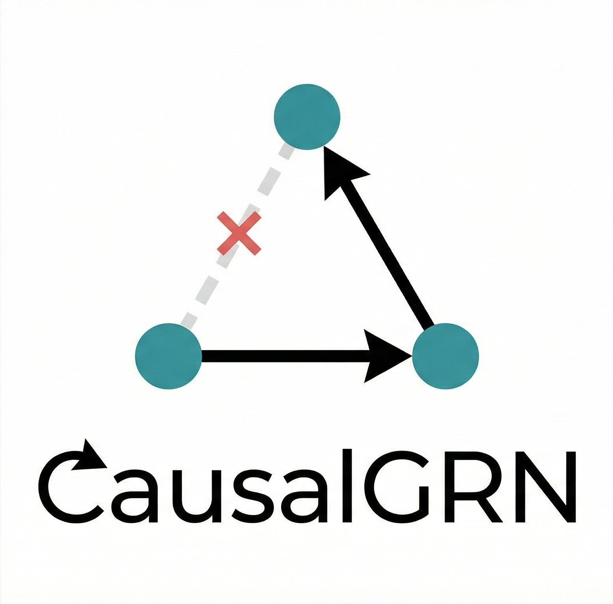
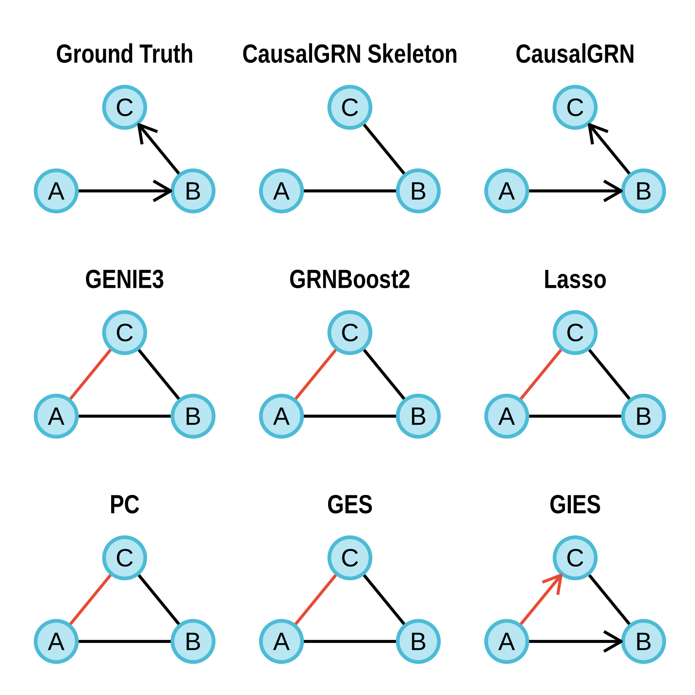

<table>
  <tr>
    <td></td>
    <td><h1>CausalGRN: Deciphering Causal Gene Regulatory Networks from Single-Cell CRISPR Screens</h1></td>
  </tr>
</table>

[](https://opensource.org/licenses/MIT)
[](https://github.com/yub-hutch/CausalGRN/actions/workflows/R-CMD-check.yaml)

**CausalGRN** is a scalable computational framework that infers causal gene regulatory networks (GRNs) and predicts cellular responses to unseen perturbations. It is designed to translate the complex outputs from large-scale single-cell CRISPR screens with scRNA-seq readouts into reliable causal insights.

## Overview

Large-scale single-cell CRISPR screens provide critical data to map causal GRNs. However, analyzing this data to extract reliable causal relationships is a major challenge. CausalGRN addresses this by:

1.  **Mitigating Spurious Correlations**: It employs a novel adaptive thresholding correction to reduce the impact of pervasive spurious partial correlations found in sparse scRNA-seq data, enabling a more robust inference of the network's undirected skeleton.
2.  **Orienting the Network**: It orients the graph using observed perturbation outcomes from CRISPR screens.
3.  **Predicting Perturbation Effects**: The resulting directed GRN can be used to predict the downstream effects of novel, unseen perturbations via network propagation.

Across both simulations and diverse experimental datasets, CausalGRN substantially outperforms existing approaches in network reconstruction accuracy and in predicting the effects of unseen perturbations.

## Installation

You can install the development version of CausalGRN from GitHub with:

```r
# install.packages("devtools")
devtools::install_github("yub-hutch/CausalGRN")
```

## Example Usage

Here is a toy example demonstrating how to use CausalGRN and comparing its output to other common GRN inference methods.

<details>
<summary>Click to expand the full example code</summary>

```r
# --- 0. SETUP: Load Libraries & Define Ground Truth ---
library(dplyr)
library(igraph)
library(CausalGRN)

# Define all simulation parameters upfront
a <- b <- 1
sd <- 2
s <- -4
nwt <- 1e5 # User-specified WT sample size
npt <- 1e4 # User-specified perturbed sample size
ko_efficacy <- 0.9 # 90% knockdown efficiency

# Define the ground truth graph for this simulation
ground_truth <- igraph::make_graph(~ A -+ B, B -+ C)
E(ground_truth)$weight <- c(a, b)

# --- 1. DATA SIMULATION: Create the Toy Example ---
set.seed(123)

# Generate Wild-Type (WT) Data
x_latent_wt <- rnorm(nwt, 0, sd)
y_latent_wt <- rnorm(nwt, a * x_latent_wt + s, sd)
z_latent_wt <- rnorm(nwt, b * (y_latent_wt - s), sd)
wt_counts <- cbind(
  X = rpois(nwt, exp(x_latent_wt)),
  Y = rpois(nwt, exp(y_latent_wt)),
  Z = rpois(nwt, exp(z_latent_wt))
)
colMeans(wt_counts == 0)

# Generate Perturb-X Data (independent population)
x_latent_template_koX <- rnorm(npt, 0, sd)
x_latent_final_koX <- x_latent_template_koX + log(1 - ko_efficacy)
y_latent_final_koX <- rnorm(npt, a * x_latent_final_koX + s, sd)
z_latent_final_koX <- rnorm(npt, b * (y_latent_final_koX - s), sd)
koX_counts <- cbind(
  X = rpois(npt, exp(x_latent_final_koX)),
  Y = rpois(npt, exp(y_latent_final_koX)),
  Z = rpois(npt, exp(z_latent_final_koX))
)
colMeans(koX_counts == 0)


# --- 2. PREPARE INPUTS for GRN Methods ---
count <- rbind(wt_counts, koX_counts)
group <- factor(c(rep('WT', nwt), rep('A', npt)))
Y <- scale(log1p(count), center = TRUE, scale = TRUE)
colnames(count) <- colnames(Y) <- c('A', 'B', 'C')
wt <- Y[group == 'WT', ]
pts <- list(
  A = Y[group == 'A', ]
)


# --- 3. RUN GRN INFERENCE METHODS ---
cat("Running GRN inference methods...\n")

# Your method: CausalGRN (uses perturbation data)
skel <- infer_skeleton(count, Y, alpha = 0.05, min_abspcor = 0, ncores = 1)
stat <- calc_perturbation_effect(Y, group, ncores = 1)
graph_cgrn <- infer_causalgrn(skel$graph, stat, alpha = 0.05, max_order = 2)

# Observational method: PC Algorithm (on WT data)
graph_pc <- run_pc(wt, alpha = 0.05)

# Observational method: GES (on WT data)
graph_ges <- run_ges(wt)

# Interventional method: GIES (uses perturbation data)
graph_gies <- run_gies(wt, pts)

# Observational method: Lasso (on WT data)
graph_lasso_wt <- run_lasso(wt, ncores = 1)

# Interventional method: Lasso (on all data)
graph_lasso_all <- run_lasso(Y, ncores = 1)

# Observational method: GENIE3 (on WT data)
graph_genie3 <- run_genie3(wt, ncores = 1)

# GRNBoost2 (requires Python environment)
# For this example, we assume pre-computed results
# graph_grnboost2 <- ...
```
</details>

## Example Output

The plot below shows the results of running the different GRN inference methods on the simulated data. The ground truth is a simple chain `A -> B -> C`. CausalGRN correctly identifies the causal structure, while other methods infer incorrect edges or directions.

<p align="center">
  
</p>

## Citation

If you use CausalGRN in your research, please cite our paper:

> **CausalGRN: deciphering causal gene regulatory networks from single-cell CRISPR screens**
>
> (Further citation details will be added upon publication)

## License

This project is licensed under the MIT License - see the [LICENSE.md](LICENSE.md) file for details.
