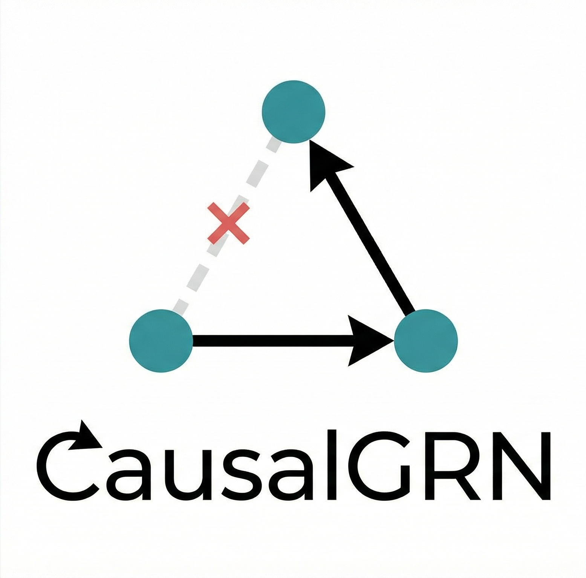

<table>
  <tr>
    <td></td>
    <td><h1>CausalGRN maps causal gene regulatory networks and predicts unseen perturbation effects from single-cell CRISPR screens</h1></td>
  </tr>
</table>

[](https://opensource.org/licenses/MIT)

**CausalGRN** is an R package for inferring causal gene regulatory networks
(GRNs) and predicting cellular responses to unseen perturbations from
single-cell CRISPR screens with scRNA-seq readouts.

## Overview

CausalGRN:

1. infers an undirected network skeleton while reducing spurious partial
   correlations in sparse scRNA-seq data;
2. orients network edges using observed perturbation effects; and
3. uses the directed network to predict downstream responses to new
   perturbations.

The package also provides GRN-scPerturbSim, a reference-data-guided simulator
for generating single-cell perturbation data under a synthetic GRN.

## Installation

Install the development version from GitHub:

```r
# Bioconductor dependencies
if (!requireNamespace(package = "BiocManager", quietly = TRUE)) {
  install.packages(pkgs = "BiocManager")
}
BiocManager::install(pkgs = c("graph", "RBGL"))

# CausalGRN
if (!requireNamespace(package = "devtools", quietly = TRUE)) {
  install.packages(pkgs = "devtools")
}
devtools::install_github(repo = "yub-hutch/CausalGRN")
```

## Tutorials

- [Quick start](tutorials/quick-start.Rmd)
  ([rendered HTML](tutorials/quick-start.html)): simulate a transparent
  three-gene example, infer a causal GRN, compare baseline methods, and
  predict perturbation effects.
- [Real-data RPE1 workflow](tutorials/real-data-rpe1.Rmd)
  ([rendered HTML](tutorials/real-data-rpe1.html)): infer a
  gene-program-aware network from a prepared Perturb-seq subset and predict
  and evaluate effects for three target genes.
- [GRN-scPerturbSim](tutorials/grn-scperturbsim.Rmd)
  ([rendered HTML](tutorials/grn-scperturbsim.html)): prepare the required
  reference input, run the simulator, and inspect its outputs.

## Input structure

The core workflow uses three aligned inputs:

- `count`: a cell-by-gene count matrix with cell and gene names;
- `Y`: a processed cell-by-gene expression matrix with the same rows and
  genes as `count`; and
- `group`: a named character vector with one label per cell. Use `"WT"` for
  wild-type cells and the perturbed gene name for perturbed cells. Its names
  must match the row names of the expression matrices.

The quick-start tutorial demonstrates the standard workflow with
`infer_skeleton()`, `calc_perturbation_effect()`, `infer_causalgrn()`,
`fit_expression_model()`, and `predict_perturbation_effect()`. The real-data
tutorial explains the corresponding gene-program-aware workflow.

## Citation

If you use CausalGRN, please cite:

> Bo Yu, Dingyu Liu, Guanghao Qi, Danwei Huangfu, Li Hsu, Ali Shojaie, Wei Sun.
> [**CausalGRN: deciphering causal gene regulatory networks from single-cell
> CRISPR screens**](https://www.biorxiv.org/content/10.64898/2025.12.30.692369v1).
> bioRxiv 2025.12.30.692369; doi:
> https://doi.org/10.64898/2025.12.30.692369

## License

This project is licensed under the MIT License; see
[LICENSE.md](LICENSE.md).

## Software notes

- **Tested environments:** macOS 26.3.1 (25D2128) with R 4.4.1; Ubuntu
  18.04.6 LTS (Bionic Beaver) with R 4.3.2; and Windows 24H2 with R 4.3.1.
- **Hardware:** no non-standard hardware is required.
- **Installation time:** installing the package locally took about 5 seconds
  on the tested macOS system after dependencies were installed.
- **Quick-start runtime:** the core workflow took about 0.5 seconds on the
  tested macOS system, excluding package installation and plotting. Runtime
  varies across systems.

Package dependencies are listed in [`DESCRIPTION`](DESCRIPTION).

## Manuscript code

Scripts for the main analyses in the manuscript are available in the
[CausalGRN manuscript-code repository](https://github.com/yub-hutch/CausalGRN-manuscript-code).
