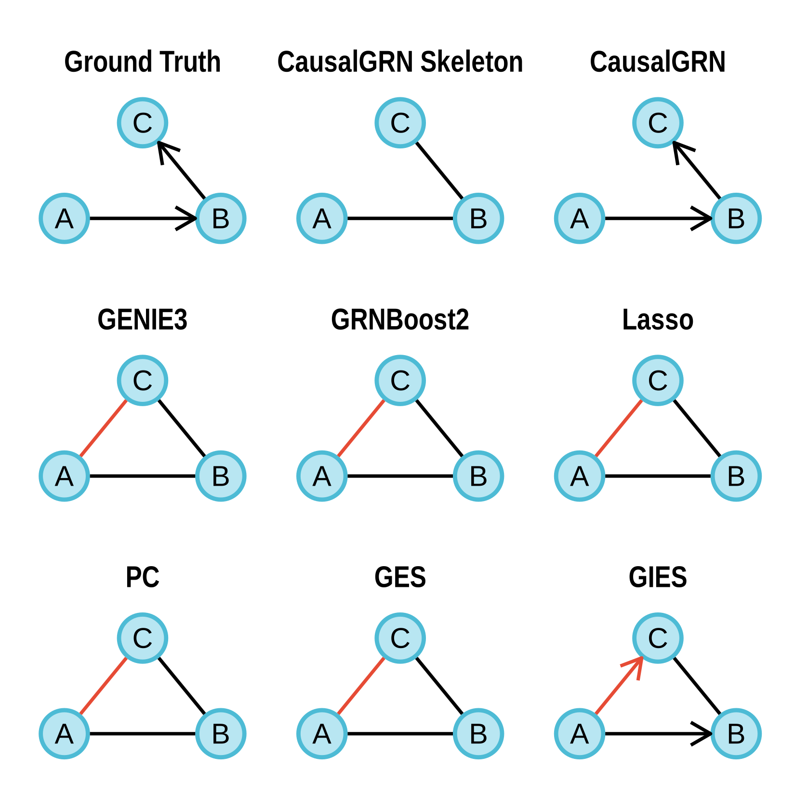
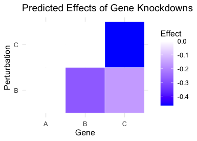

```{r setup, include = FALSE}
knitr::opts_chunk$set(
  collapse = TRUE,
  comment = "#>",
  message = FALSE,
  warning = FALSE
)
```

This tutorial demonstrates the complete CausalGRN workflow: infer a causal
gene regulatory network (GRN), fit an expression model, and predict
perturbation effects.

The example deliberately uses a hand-written three-gene model with structure
`A -> B -> C`. It is not generated by GRN-scPerturbSim. That simulator is
reference-data-driven and is intended to reproduce properties of a supplied
single-cell perturbation dataset. The fixed three-gene model here is only a
transparent example of package usage.

# Create the toy data

## Data-generating model

Let \(Z_A\), \(Z_B\), and \(Z_C\) denote latent log-expression. Wild-type cells
are generated as

\[
\begin{aligned}
Z_A &\sim \mathrm{Normal}(0, sd^2),\\
Z_B \mid Z_A &\sim \mathrm{Normal}(aZ_A + s, sd^2),\\
Z_C \mid Z_B &\sim \mathrm{Normal}\{b(Z_B-s), sd^2\},\\
X_g \mid Z_g &\sim \mathrm{Poisson}\{\exp(Z_g)\},
\quad g \in \{A,B,C\}.
\end{aligned}
\]

For a knockdown, `log(1 - knockdown_efficacy)` is added to the target's latent
log-expression before its descendants are generated. Thus the target's
Poisson rate is multiplied by `1 - knockdown_efficacy`, and the effect
propagates along the chain.

## Simulate counts and prepare inputs

```{r data-simulation}
library(dplyr)
library(igraph)
library(CausalGRN)

set.seed(123)

# Parameters of the hand-written toy model
a <- b <- 1                  # edge coefficients: A -> B and B -> C
sd <- 2                      # latent normal standard deviation
s <- -4                      # intercept used when generating B
nwt <- 1e5                   # number of wild-type cells
npt <- 1e4                   # number of cells per knockdown
knockdown_efficacy <- 0.9    # 90% reduction in the target's Poisson rate

ground_truth <- igraph::make_graph(~ A -+ B, B -+ C)
E(ground_truth)$weight <- c(a, b)

# Wild-type cells
x_latent_wt <- rnorm(nwt, 0, sd)
y_latent_wt <- rnorm(nwt, a * x_latent_wt + s, sd)
z_latent_wt <- rnorm(nwt, b * (y_latent_wt - s), sd)
wt_counts <- cbind(
  A = rpois(nwt, exp(x_latent_wt)),
  B = rpois(nwt, exp(y_latent_wt)),
  C = rpois(nwt, exp(z_latent_wt))
)

# A-knockdown cells
x_latent_kdA <- rnorm(npt, 0, sd) + log(1 - knockdown_efficacy)
y_latent_kdA <- rnorm(npt, a * x_latent_kdA + s, sd)
z_latent_kdA <- rnorm(npt, b * (y_latent_kdA - s), sd)
kdA_counts <- cbind(
  A = rpois(npt, exp(x_latent_kdA)),
  B = rpois(npt, exp(y_latent_kdA)),
  C = rpois(npt, exp(z_latent_kdA))
)

# B-knockdown cells
x_latent_kdB <- rnorm(npt, 0, sd)
y_latent_kdB <- rnorm(npt, a * x_latent_kdB + s, sd) +
  log(1 - knockdown_efficacy)
z_latent_kdB <- rnorm(npt, b * (y_latent_kdB - s), sd)
kdB_counts <- cbind(
  A = rpois(npt, exp(x_latent_kdB)),
  B = rpois(npt, exp(y_latent_kdB)),
  C = rpois(npt, exp(z_latent_kdB))
)

# C-knockdown cells
x_latent_kdC <- rnorm(npt, 0, sd)
y_latent_kdC <- rnorm(npt, a * x_latent_kdC + s, sd)
z_latent_kdC <- rnorm(npt, b * (y_latent_kdC - s), sd) +
  log(1 - knockdown_efficacy)
kdC_counts <- cbind(
  A = rpois(npt, exp(x_latent_kdC)),
  B = rpois(npt, exp(y_latent_kdC)),
  C = rpois(npt, exp(z_latent_kdC))
)

# CausalGRN inputs
count <- rbind(wt_counts, kdA_counts, kdB_counts, kdC_counts)
group <- c(rep('WT', nwt), rep('A', npt), rep('B', npt), rep('C', npt))
rownames(count) <- paste0("cell", seq_len(nrow(count)))
names(group) <- rownames(count)
Y <- scale(log1p(count), center = TRUE, scale = TRUE)
```

`count` is the raw cell-by-gene count matrix, `Y` is its normalized version,
and `group` gives the perturbation label for every cell.

# Infer a causal GRN

## Select cells for inference

We use the wild-type and `A`-knockdown cells to infer the network. The `B` and
`C` knockdowns are used later to demonstrate perturbation-effect prediction.

```{r training-data}
train_idx <- which(group %in% c('WT', 'A'))
```

## Estimate the graph skeleton

`infer_skeleton()` starts from a fully connected graph and removes gene pairs
that are conditionally independent. Its arguments are:

- `count`: the raw cell-by-gene count matrix for the selected cells, used when
  choosing expression thresholds for conditional-independence tests;
- `Y`: the normalized cell-by-gene expression matrix for the same cells, used
  to calculate correlations and partial correlations;
- `alpha`: the significance threshold for conditional-independence tests;
- `min_abspcor`: the minimum absolute partial correlation required to retain an
  edge, set to zero here so no effect-size threshold is imposed; and
- `ncores`: the number of CPU cores used for computation.

The function returns a list. `skel$graph` is the estimated graph skeleton, and
`skel$sepSet` contains the separating sets identified by the tests.

```{r infer-skeleton}
skel <- infer_skeleton(
  count = count[train_idx, ],
  Y = Y[train_idx, ],
  alpha = 0.05,
  min_abspcor = 0,
  ncores = 1
)
```

## Estimate perturbation effects

`calc_perturbation_effect()` compares every non-WT group with the WT group for
each gene. In this subset, it compares the `A` knockdown with WT. Its arguments
are:

- `Y`: the normalized expression matrix containing WT and `A`-knockdown cells;
- `group`: the named cell-label vector aligned with the rows of `Y`, where
  `"WT"` identifies the reference cells and `"A"` identifies the perturbed
  cells; and
- `ncores`: the number of CPU cores used for computation.

The returned table contains the mean difference, Cohen's d, Wilcoxon and
t-test p-values, correlations, and adjusted p-values for every
perturbation-gene pair. `adj_pv` is the larger of the BH-adjusted Wilcoxon and
t-test p-values, so an effect passes a given threshold only when both tests do.
This `adj_pv` column is used to orient the graph.

```{r orient-network}
stat <- calc_perturbation_effect(
  Y = Y[train_idx, ],
  group = group[train_idx],
  ncores = 1
)
```

## Orient the graph

`infer_causalgrn()` directs edges in the skeleton using the perturbation
effects. Its arguments are:

- `graph`: the skeleton returned as `skel$graph`;
- `stat`: the perturbation-effect table returned by
  `calc_perturbation_effect()`;
- `alpha`: the significance threshold applied to the adjusted differential
  expression p-values in `stat$adj_pv`; and
- `max_order`: the maximum order of descendant-based orientation, set to two
  here to allow orientation using effects transmitted through one intermediate
  gene.

The function returns the directed GRN as an `igraph` object.

```{r orient-graph}
inferred_graph <- infer_causalgrn(
  graph = skel$graph,
  stat = stat,
  alpha = 0.05,
  max_order = 2
)
print(inferred_graph)
```

The inferred edges recover the generating chain `A -> B -> C`.

## Compare GRN methods

```{r grn-comparison-figure, echo = FALSE, fig.align = "center", out.width = "70%", fig.cap = "CausalGRN and baseline GRN estimates for the toy example."}

```

<details>
<summary>Optional: run baseline GRN methods</summary>

These wrappers support convenient benchmarking and are not part of the core
CausalGRN algorithm. This block preserves the inputs used in the original
example. It is not evaluated while rendering the tutorial because some methods
are slower and require suggested packages.

```{r baseline-comparison, eval = FALSE}
cat("Running other GRN methods for comparison...\n")

wt <- Y[group == 'WT', ]
pts <- list(
  A = Y[group == 'A', ]
)

graph_pc <- run_pc(wt = wt, alpha = 0.05)
graph_ges <- run_ges(wt = wt)
graph_gies <- run_gies(wt = wt, pts = pts)
graph_lasso_wt <- run_lasso(Y = wt, ncores = 1)
graph_lasso_all <- run_lasso(Y = Y, ncores = 1)
graph_genie3 <- run_genie3(wt = wt, ncores = 1)

# GRNBoost2 requires a Python environment.
# graph_grnboost2 <- ...
```

</details>

# Predict effects of the B and C knockdowns

## Fit the expression model

`fit_expression_model()` fits a separate regression model for each target
gene. The incoming neighbors of a target in `graph` are used as its predictors,
and cells in which that target gene is perturbed are excluded from its model.
Its arguments are:

- `Y`: the normalized expression matrix used to fit the regressions;
- `group`: the named perturbation labels aligned with the rows of `Y`;
- `graph`: the inferred directed GRN, which determines the predictors allowed
  for each target gene;
- `ncores`: the number of CPU cores used to fit the gene-specific models; and
- `method`: the regression method, set to `"lm"` for ordinary least squares.

The returned coefficient matrix has sources (plus an intercept) in rows and
target genes in columns.

```{r fit-expression-model}
B_fit <- fit_expression_model(
  Y = Y[train_idx, ],
  group = group[train_idx],
  graph = inferred_graph,
  ncores = 1,
  method = 'lm'
)
```

## Predict perturbation effects

`predict_perturbation_effect()` converts each specified target expression level
to a change from WT and propagates that change through the fitted regulatory
coefficients. Its arguments are:

- `B`: the source-by-target coefficient matrix returned by
  `fit_expression_model()`;
- `ko_expressions`: a named numeric vector giving the normalized expression
  level of each perturbed target gene in its knockdown cells; and
- `wt_expressions`: a named numeric vector giving the WT mean normalized
  expression of every gene.

The returned matrix contains predicted changes from WT, with perturbations in
rows and genes in columns. Only the expression of the perturbed target (`B` or
`C`) is supplied from each knockdown group; the downstream expression values
are not passed to the prediction function.

```{r predict-effects}
wt_expressions <- colMeans(Y[group == 'WT', ])
knockdown_expressions <- c(
  'B' = mean(Y[group == 'B', 'B']),
  'C' = mean(Y[group == 'C', 'C'])
)

pred_effects <- predict_perturbation_effect(
  B = B_fit,
  ko_expressions = knockdown_expressions,
  wt_expressions = wt_expressions
)
print(pred_effects)
```

## Visualize predicted effects

The following code converts the prediction matrix to long format and plots a
heatmap:

```{r plot-predicted-effects, eval = FALSE}
plot_df <- as.data.frame(as.table(pred_effects))
names(plot_df) <- c("Perturbation", "Gene", "Effect")

ggplot2::ggplot(
  plot_df,
  ggplot2::aes(x = Gene, y = Perturbation, fill = Effect)
) +
  ggplot2::geom_tile(color = "white") +
  ggplot2::scale_fill_gradient2(
    low = "blue", mid = "white", high = "red", midpoint = 0
  ) +
  ggplot2::theme_minimal() +
  ggplot2::labs(
    title = "Predicted Effects of Gene Knockdowns",
    fill = "Effect"
  )
```

```{r predicted-effect-figure, echo = FALSE, fig.align = "center", out.width = "45%", fig.cap = "Predicted effects of the B and C knockdowns."}

```

As expected from `A -> B -> C`, knocking down `B` affects both `B` and `C`,
whereas knocking down `C` affects `C` but not its upstream genes.
